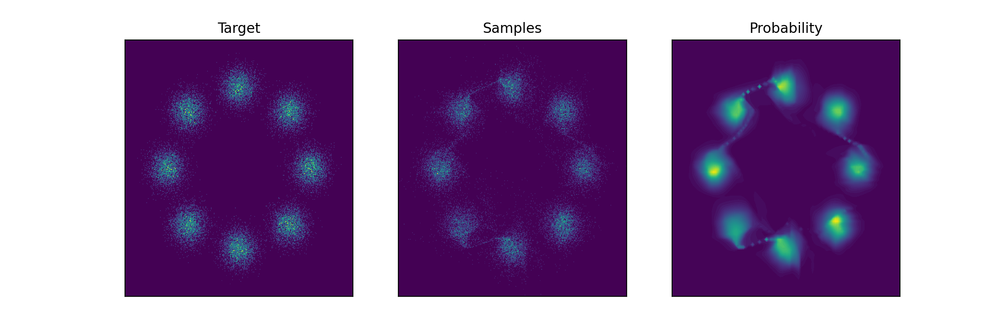

# KRnet implemented by Pytorch
unofficial implementation Code for KRnet https://doi.org/10.1016/j.jcp.2022.111080. 

# Install
Pytorch needs to be installed independently following the instruction on the [Pytorch homepage](https://pytorch.org/).
This repo also has dependency on numpy, matplotlib, sklearn. 


## Experiments
Experiments may be run with the following commands. 
Run the following script for eight Gaussian density estimation.
```shell
python density_estimation.py # density estimation for eight Gaussian
```
If you successfully run this script, you will get the result image like that.



## Citation

If you use this code in your research, please cite it as:

```
@article{tang2020deep, title={Deep density estimation via invertible block-triangular mapping}, volume={10}, ISSN={2095-0349}, url={http://dx.doi.org/10.1016/j.taml.2020.01.023}, DOI={10.1016/j.taml.2020.01.023}, number={3}, journal={Theoretical and Applied Mechanics Letters}, publisher={Elsevier BV}, author={Tang, Keju and Wan, Xiaoliang and Liao, Qifeng}, year={2020}, month={Mar}, pages={143–148} }
```
and
```
@article{tang2022adaptive, title={Adaptive deep density approximation for Fokker-Planck equations}, volume={457}, ISSN={0021-9991}, url={http://dx.doi.org/10.1016/j.jcp.2022.111080}, DOI={10.1016/j.jcp.2022.111080}, journal={Journal of Computational Physics}, publisher={Elsevier BV}, author={Tang, Kejun and Wan, Xiaoliang and Liao, Qifeng}, year={2022}, month={May}, pages={111080} }
```
